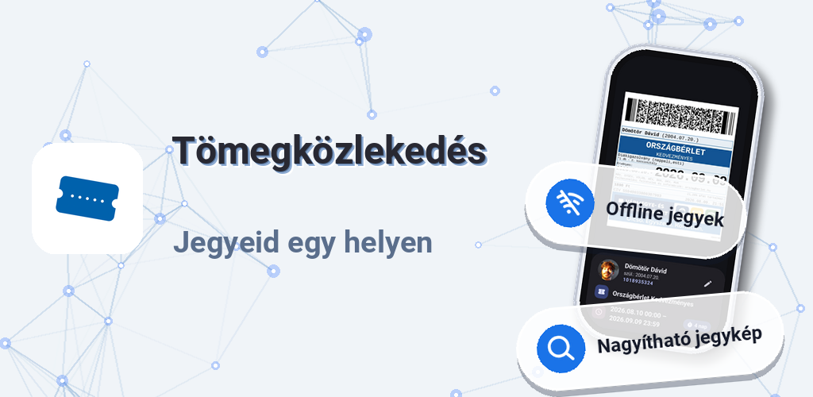
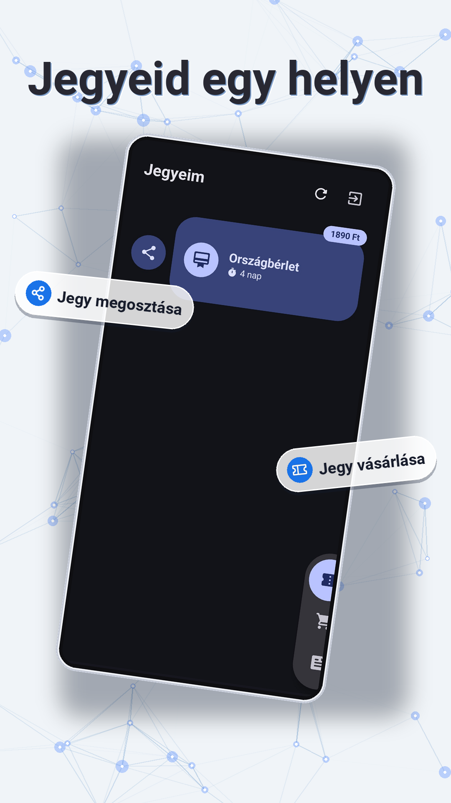
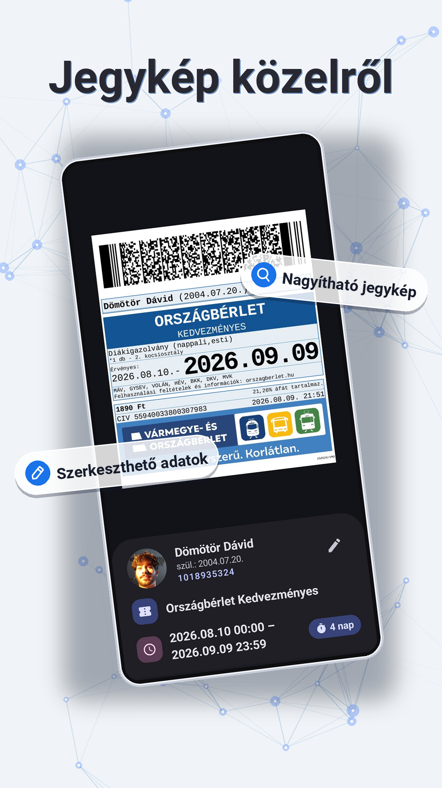
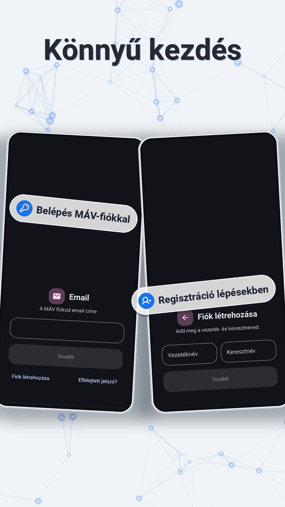
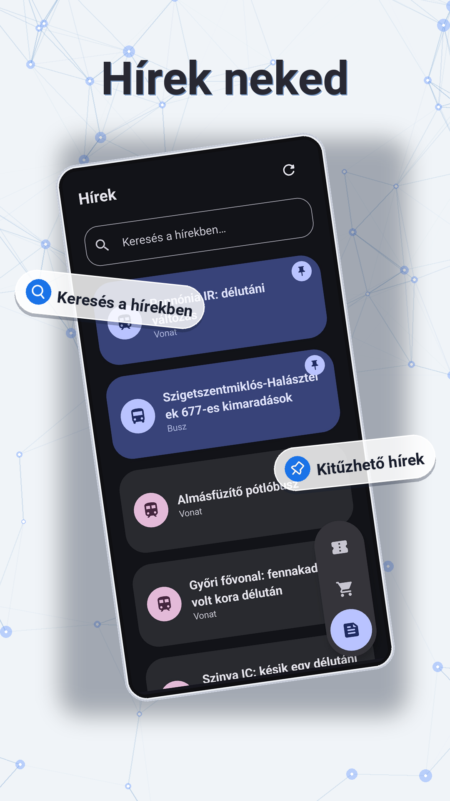
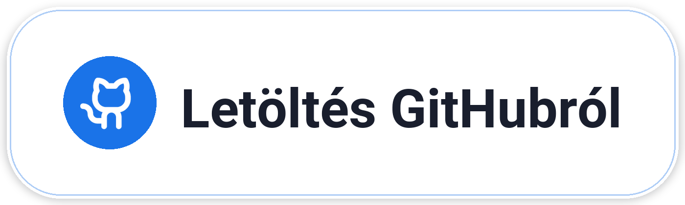
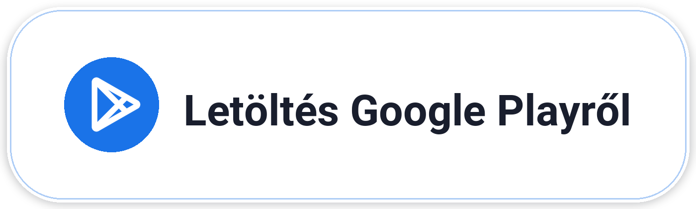

# Tömegközlekedés

## Letöltés

## Használat

Regisztrálj fiókot, vagy jelentkezz be a MÁV-fiókodba! Ezt egyszer kell megtenned az alkalmazásban, **illetve a jegyvásárlási felületen is**.
A teljes alkalmazás egy kézzel könnyen kezelhető, akár jobb, akár bal kézzel is.

## Funkciók

- **Offline** is könnyen eléred a jegyeidet és bérleteidet, akármerre is utazol, és le tudod menteni őket akár a galériádba, vagy meg is oszthatod a barátaiddal.
- Jegyeket és bérleteket tudsz könnyedén vásárolni.
- Az **utazási híreket** is itt találod, így mindent el tudsz egy appon belül intézni utazás előtt és közben is.
- Állítsd a jegyed **akkora méretűre és oda, ahova szeretnéd**, így nem kell a buszon azzal bajlódni, hogy eltaláld, hol olvassa be a szkenner a jegyedet.

---

## Miért válts?
Ha eleged van abból, hogy a MÁV hivatalos alkalmazása lassú, illetve biztos akarsz lenni abban, hogy az alkalmazás minden frissítés után jól működjön, akkor ez az app neked lett kitalálva.

---

## Licenc

Ez a szoftver **MIT licenc** alatt áll. A licenc szövege a `LICENSE` fájlban található.

Ez az alkalmazás a hivatalos **MÁV alkalmazás** visszafejtett változata.
Az alkalmazás nem áll kapcsolatban a MÁV Zrt.-vel, nem tőlük származik, és a MÁV semmilyen
formában nem támogatja, nem hagyja jóvá és nem hitelesíti. A projekt célja kizárólag az, hogy
egy nyílt, a hivatalos klienstől független alternatív felületet biztosítson.

## Technikai információ
*! Az alkalmazás build flow-ja termuxra van optimalizálva, ezért gépen buildelve lehet configolni kell.*

Az appot többféle AI ágens készítette *(Muse Spark 1.3, MiMo V2.5, Hy3)*, OpenCode alatt, illetve többféle python könyvtár használatával készültek a grafikus elemek.

## Letöltés

